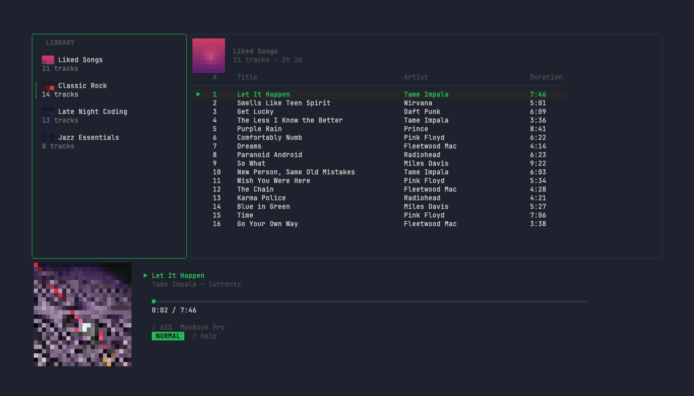
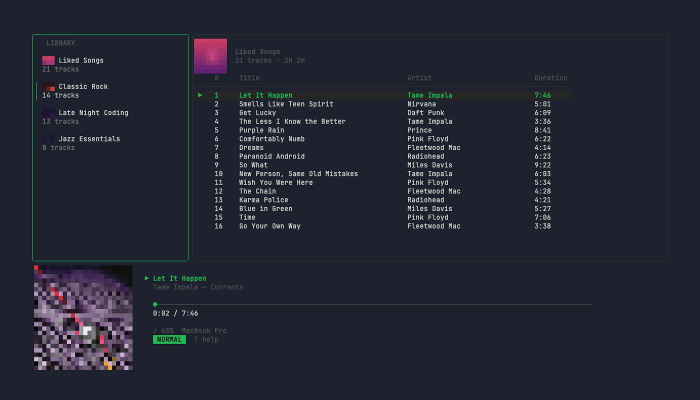
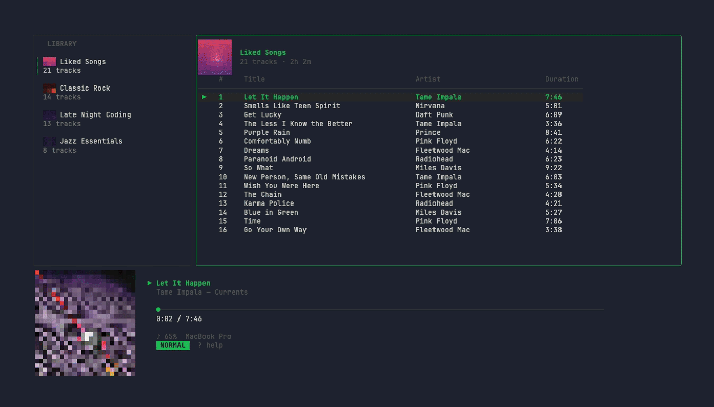
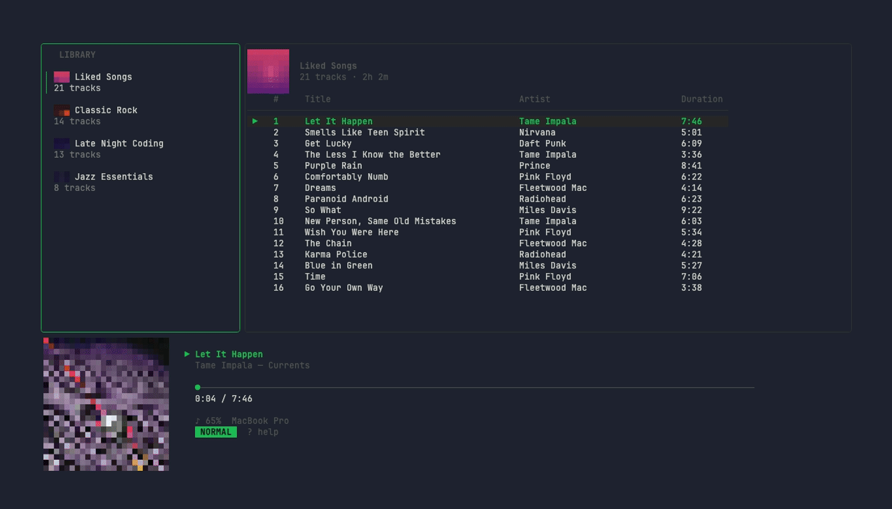

<p align="center">
  
</p>

<h1 align="center">waxon</h1>

<p align="center">
  A vim-modal Spotify client for the terminal.
</p>

<p align="center">
  <a href="#install">Install</a> &middot;
  <a href="#features">Features</a> &middot;
  <a href="#keybindings">Keybindings</a> &middot;
  <a href="#commands">Commands</a>
</p>

<p align="center">
  
</p>

## Install

**Homebrew:**

```
brew install danfry1/tap/waxon
```

**Go:**

```
go install github.com/danfry1/waxon@latest
```

**Binary:** download from the [Releases](https://github.com/danfry1/waxon/releases) page.

## Quick Start

```bash
waxon auth    # Connect your Spotify account (one-time setup)
waxon         # Launch the TUI
```

Requires a **Spotify Premium** account and a terminal with **true color** support.

## Features

### Vim Navigation

Navigate everything without leaving the home row — `j`/`k` to move, `gg`/`G` to jump, `h`/`l` to switch panes.

<p align="center">
  
</p>

### Now Playing

Full-screen album art rendered with Unicode half-blocks, gradient backgrounds, and a vinyl spinning mode.

<p align="center">
  
</p>

### Search

Find tracks, artists, and albums across Spotify.

<p align="center">
  
</p>

### Artist & Album Browsing

Explore discographies, browse full albums, and navigate with a browser-like back stack.

<p align="center">
  
</p>

### Command Mode

Vim-style commands for volume, shuffle, repeat, device switching, and more.

<p align="center">
  
</p>

## Keybindings

### Navigation

| Key              | Action              |
|------------------|---------------------|
| `j` / `k`        | Move down / up      |
| `gg`             | Go to top           |
| `G`              | Go to bottom        |
| `Ctrl+u` / `Ctrl+d` | Half page up / down |

### Panes

| Key              | Action              |
|------------------|---------------------|
| `h` / `l`        | Focus left / right pane |
| `Tab`            | Cycle pane          |
| `1` / `2`        | Library / queue section |

### Go-to (g prefix)

| Key   | Action                      |
|-------|-----------------------------|
| `gl`  | Go to library               |
| `gq`  | Go to queue                 |
| `gc`  | Jump to currently playing track |
| `gr`  | Recently played             |

### Playback

| Key              | Action              |
|------------------|---------------------|
| `Space`          | Play / pause        |
| `Enter`          | Play selected       |
| `n` / `p`        | Next / previous track |
| `[` / `]`        | Seek -5s / +5s      |

### Actions

| Key   | Action              |
|-------|---------------------|
| `o`   | Context actions menu |
| `a`   | Add to queue        |
| `x`   | Remove              |
| `/`   | Filter current view |
| `s`   | Spotify search      |
| `D`   | Device switcher     |
| `:`   | Command mode        |

### Other

| Key              | Action              |
|------------------|---------------------|
| `N`              | Now Playing view    |
| `V`              | Toggle vinyl mode (in Now Playing) |
| `Backspace` / `b` | Go back           |
| `?`              | Toggle help overlay |
| `q`              | Quit               |
| `Esc`            | Close / cancel      |

## Commands

Enter command mode by pressing `:`, then type a command.

| Command                 | Description          |
|-------------------------|----------------------|
| `:vol <0-100>`          | Set volume           |
| `:shuffle`              | Toggle shuffle       |
| `:repeat off\|all\|one` | Set repeat mode      |
| `:device`               | Open device switcher |
| `:search <query>`       | Search Spotify       |
| `:recent`               | Recently played      |
| `:q`                    | Quit                 |

## Using Your Own Spotify App (Optional)

waxon works out of the box with no configuration — it ships with a shared client ID used by several open-source Spotify clients. Most users don't need to change anything.

If you'd prefer to use your own Spotify developer app:

1. Go to the [Spotify Developer Dashboard](https://developer.spotify.com/dashboard) and create an app
2. Set the redirect URI to `http://127.0.0.1` (any port — waxon picks one automatically)
3. Copy the **Client ID** and run setup with it:

   ```
   SPOTIFY_CLIENT_ID=your_client_id waxon auth
   ```

The client ID is saved to `~/.config/waxon/config.json` automatically, so you only need to set the environment variable once during setup.

## Environment Variables

| Variable            | Description                        |
|---------------------|------------------------------------|
| `SPOTIFY_CLIENT_ID` | Override the saved Spotify Client ID |
| `WAXON_LOG`         | Path to debug log file (e.g. `/tmp/waxon.log`) |

## License

This project is licensed under the [GNU General Public License v3.0](LICENSE).
