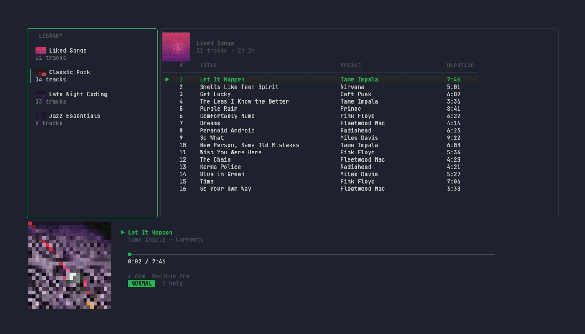
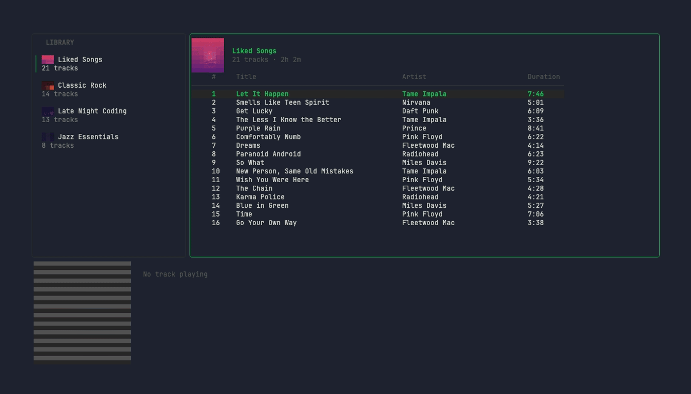
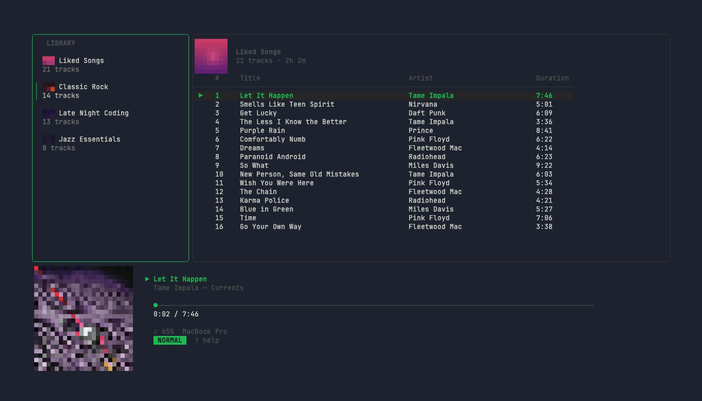
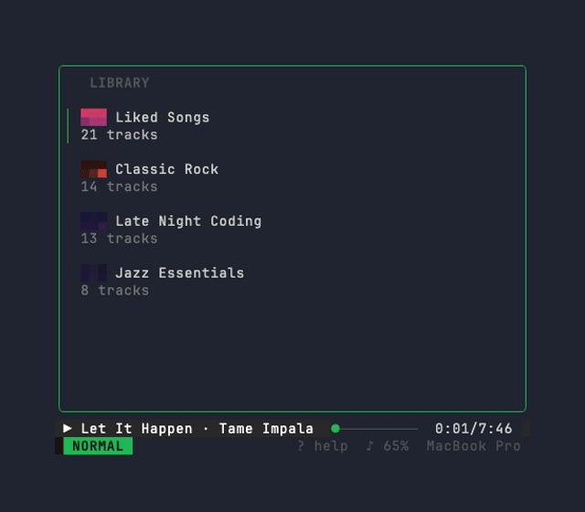
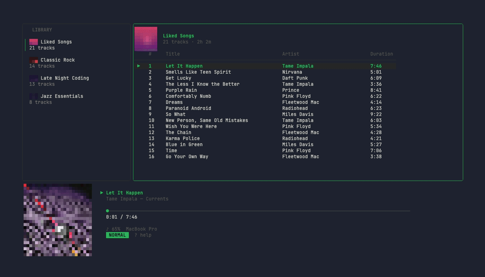
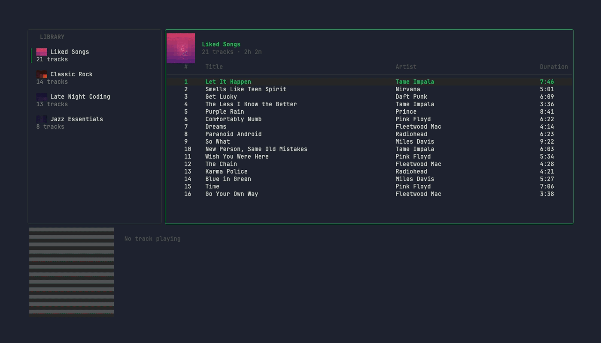
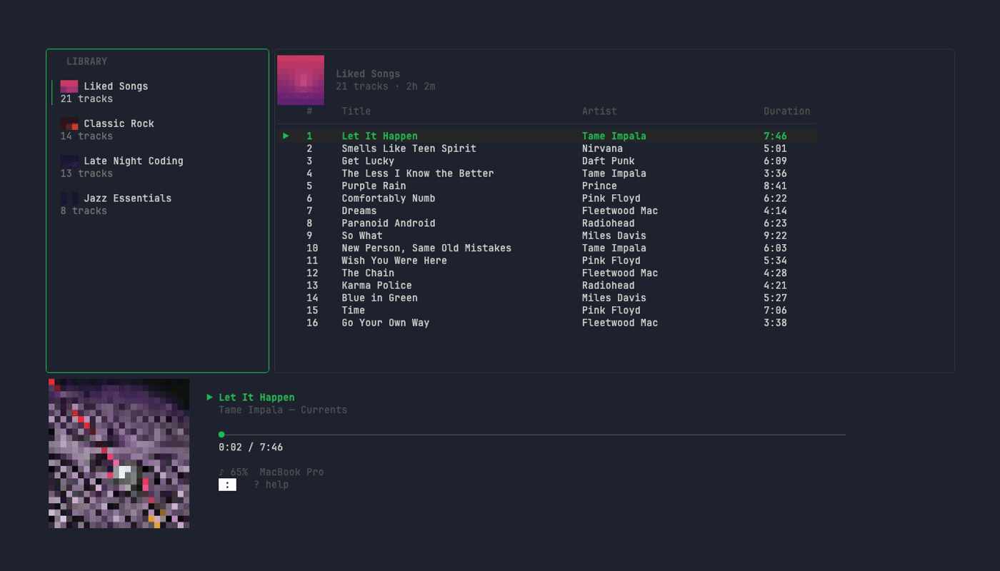

<p align="center">
  
</p>

<h1 align="center">waxon</h1>

<p align="center">
  A vim-modal Spotify client for the terminal.
</p>

<p align="center">
  <a href="#install">Install</a> &middot;
  <a href="#features">Features</a> &middot;
  <a href="#keybindings">Keybindings</a> &middot;
  <a href="#commands">Commands</a>
</p>

<p align="center">
  
</p>

## Install

**Homebrew:**

```
brew trust danfry1/tap        # one-time: trust the third-party tap
brew install danfry1/tap/waxon
```

> Recent Homebrew versions refuse to load formulae from third-party taps until
> they're trusted. If you see `Error: Refusing to load formula ... from
> untrusted tap`, run the `brew trust danfry1/tap` line above (once) and retry.

**Go:**

```
go install github.com/danfry1/waxon@latest
```

**Binary:** download from the [Releases](https://github.com/danfry1/waxon/releases) page.

## Quick Start

```bash
waxon auth    # Connect your Spotify account (one-time setup)
waxon         # Launch the TUI
```

Requires a **Spotify Premium** account. True-colour terminals get the full look; 256-colour and `NO_COLOR` terminals are supported with graceful fallbacks.

waxon is a remote control for Spotify Connect: it plays through whatever Spotify
client is running (desktop app, phone, speaker). If nothing is active when you
press play, waxon picks the only available device for you — or asks which one
to use when there are several.

<p align="center">
  
</p>

## Features

### Vim Navigation

Navigate everything without leaving the home row — `j`/`k` to move, `gg`/`G` to jump, `h`/`l` to switch panes.

<p align="center">
  
</p>

### Small Terminals

Below 80 columns waxon shows one pane at a time — `h`/`l`/`Tab` switch between library and tracks — and the track table drops columns rather than overflowing. Now Playing art scales to fit. Handy for a tmux side pane.

<p align="center">
  
</p>

### Now Playing

Full-screen album art rendered with Unicode half-blocks, gradient backgrounds, and a vinyl spinning mode.

<p align="center">
  
</p>

### Synced Lyrics

Press `l` in Now Playing for time-synced lyrics (via [lrclib](https://lrclib.net) — no account, no API key, nothing to set up). The current line lights up and the rest gently fade as the song plays.

<p align="center">
  
</p>

### Playlists

`o` on any track offers **Add to Playlist…** (type to filter your playlists) and, inside one of your own playlists, **Remove from …**. Create a new one with `:playlist new <name>`. Changes show up immediately in the sidebar and the open playlist.

<p align="center">
  
</p>

> Upgrading? Playlist editing needs two extra Spotify permissions; waxon will ask you to run `waxon auth` once.

### Search

Find tracks, artists, and albums across Spotify.

<p align="center">
  
</p>

### Artist & Album Browsing

Explore discographies, browse full albums, and navigate with a browser-like back stack.

<p align="center">
  
</p>

### Command Mode

Vim-style commands for volume, shuffle, repeat, device switching, and more.

<p align="center">
  
</p>

## Keybindings

### Navigation

| Key              | Action              |
|------------------|---------------------|
| `j` / `k`        | Move down / up      |
| `gg`             | Go to top           |
| `G`              | Go to bottom        |
| `Ctrl+u` / `Ctrl+d` | Half page up / down |

### Panes

| Key              | Action              |
|------------------|---------------------|
| `h` / `l`        | Focus left / right pane |
| `Tab`            | Cycle pane          |
| `1` / `2`        | Library / queue section |

### Go-to (g prefix)

| Key   | Action                      |
|-------|-----------------------------|
| `gl`  | Go to library               |
| `gq`  | Go to queue                 |
| `gc`  | Jump to currently playing track (loads its playlist/album if you've navigated away) |
| `gr`  | Recently played             |

### Playback

| Key              | Action              |
|------------------|---------------------|
| `Space`          | Play / pause        |
| `Enter`          | Play selected       |
| `n` / `p`        | Next / previous track |
| `[` / `]`        | Seek -5s / +5s      |

### Actions

| Key   | Action              |
|-------|---------------------|
| `o`   | Context actions menu |
| `a`   | Add to queue        |
| `/`   | Filter current view |
| `s`   | Spotify search      |
| `D`   | Device switcher     |
| `:`   | Command mode        |

### Other

| Key              | Action              |
|------------------|---------------------|
| `N`              | Now Playing view    |
| `f` / `a` / `o`  | Like / queue / actions for the **playing** track (in Now Playing) |
| `V`              | Toggle vinyl mode (in Now Playing) |
| `l`              | Toggle synced lyrics (in Now Playing) |
| `Backspace` / `b` | Go back           |
| `?`              | Toggle help overlay |
| `q`              | Quit               |
| `Esc`            | Close / cancel      |

## Commands

Enter command mode by pressing `:`, then type a command.

| Command                 | Description          |
|-------------------------|----------------------|
| `:vol <0-100>`          | Set volume           |
| `:shuffle`              | Toggle shuffle       |
| `:repeat off\|all\|one` | Set repeat mode      |
| `:device`               | Open device switcher |
| `:search <query>`       | Search Spotify       |
| `:recent`               | Recently played      |
| `:theme <name>`         | Switch colour theme (saved to config) |
| `:playlist new <name>`  | Create a playlist    |
| `:q`                    | Quit                 |

## Configuration

waxon reads `~/.config/waxon/config.json` (`$XDG_CONFIG_HOME` respected; `waxon config` prints the path). Everything is optional:

```json
{
  "theme": "catppuccin-mocha",
  "colors": { "accent": "#F5C2E7" },
  "keys":   { "next": "l,right", "prev": "h,left", "quit": "ctrl+q" }
}
```

**Themes** — built in: `spotify` (default), `catppuccin-mocha`, `catppuccin-latte`, `gruvbox`, `tokyonight`, `nord`, `dracula`, `rose-pine` (`waxon themes` lists them; waxon doesn't paint the terminal background, so pick a light theme like `catppuccin-latte` for a light terminal). Switch live with `:theme <name>` — it's saved to your config. `colors` overrides individual palette entries on top of any theme: `accent`, `bg`, `surface`, `text`, `text_sec`, `text_dim`, `border`, `error`, `mode_search`, `mode_filter`, `overlay`.

<p align="center">
  
</p>

**Keys** — `keys` maps an action to a comma-separated list of keys (Bubbletea names: `j`, `down`, `ctrl+d`, `space`, `enter`, `esc`, `tab`, `backspace`, `f1`…). Actions: `up down bottom half_up half_down focus_left focus_right cycle_pane enter play_pause next prev seek_fwd seek_back add_queue like actions devices back filter search command help now_playing quit escape section1 section2`. The `g`-prefix motions (`gg gl gq gc gr`) are fixed. The `?` help overlay always shows your live bindings.

**Cache** — album art is cached under `$XDG_CACHE_HOME/waxon/images` (or your OS cache dir), capped at 64 MB and pruned on launch, so relaunching paints the library instantly. Delete the directory to clear it.

**Colour fallback** — colours degrade automatically on 256-colour terminals and are dropped under `NO_COLOR`; album art uses the 256-colour cube where true colour isn't available and is skipped entirely on monochrome terminals.

## Scripting & Status Bars

Every playback action is also a plain subcommand, so waxon slots into tmux,
waybar/polybar, hotkey daemons and shell scripts without opening the TUI.

```
waxon status                      # ▶ Let It Happen — Tame Impala
waxon status --json               # {"playing":true,"title":...,"progress":37,...}
waxon status --waybar             # {"text":"…","alt":"playing","class":"playing",...}
waxon status --format '{icon} {title} [{position}/{duration}]'
waxon play | pause | toggle | next | prev
waxon play daft punk get lucky    # search, then play the first match
waxon seek +10 | seek -10 | seek 1:30
waxon vol 40 | vol +5 | vol -5
waxon shuffle [on|off] | repeat off|all|one
waxon like                        # toggle Liked Songs for the playing track
waxon queue instant crush
waxon devices | device "living room"
waxon search radiohead [--json]
```

`status` prints nothing when idle (so bars stay blank) and exits non-zero on
errors; `--json` always emits an object. Placeholders for `--format`:
`{title} {artist} {album} {position} {duration} {progress} {state} {icon}
{device} {volume} {shuffle} {repeat} {liked} {uri} {id}`. If no Spotify device
is active, commands activate the only available one automatically, or tell you
which ones to choose from.

<p align="center">
  
</p>

**tmux** (`~/.tmux.conf`):

```
set -g status-right '#(waxon status --format "{icon} {title} — {artist}") | %H:%M'
set -g status-interval 5
```

**waybar** (`~/.config/waybar/config`) — `--waybar` emits the
`text/alt/class/tooltip/percentage` object waybar expects:

```json
"custom/spotify": {
  "exec": "waxon status --waybar",
  "return-type": "json",
  "format": "{icon} {}",
  "format-icons": {"playing": "", "paused": "", "idle": ""},
  "on-click": "waxon toggle",
  "on-scroll-up": "waxon vol +5",
  "on-scroll-down": "waxon vol -5",
  "interval": 5
}
```

**Hotkeys** (skhd on macOS / sxhkd on Linux):

```
cmd + alt - space : waxon toggle
cmd + alt - right : waxon next
cmd + alt - left  : waxon prev
cmd + alt - l     : waxon like
```

## Using Your Own Spotify App (Recommended if you see rate limits)

waxon works out of the box with no configuration — it ships with a shared client ID used by several open-source Spotify clients. Spotify rate-limits that shared app as a whole, so at busy times you may see *Spotify rate limit* toasts or sluggish controls. A personal client ID has its own quota and takes two minutes to set up:

1. Go to the [Spotify Developer Dashboard](https://developer.spotify.com/dashboard) and create an app
2. Set the redirect URI to `http://127.0.0.1:27228/callback`
3. Copy the **Client ID** and run setup with it:

   ```
   SPOTIFY_CLIENT_ID=your_client_id waxon auth
   ```

The client ID is saved to `~/.config/waxon/config.json` automatically, so you only need to set the environment variable once during setup.

> **Trade-off:** Spotify keeps new developer apps in *development mode* and blocks a few endpoints for them — notably liking/unliking tracks (and the ♥ indicator) and artists' top tracks. waxon detects this and degrades (artist pages show the discography; `f` explains why it can't like). Everything else — playback, search, playlists, queue — works, without the shared app's rate limits.

## Troubleshooting

| Symptom | Cause / fix |
|---|---|
| *Spotify rate limit* / *Spotify is rate limiting* toasts | Spotify is throttling the app. waxon backs off automatically and honours Spotify's `Retry-After`. If it keeps happening, the shared client ID is busy — [use your own](#using-your-own-spotify-app-recommended-if-you-see-rate-limits). |
| *No active Spotify device* | Spotify must be open somewhere (desktop, phone, speaker). waxon picks the only available device automatically or asks with `D`. |
| *Not available with this Spotify app* | You're on a personal client ID in Spotify development mode; Spotify blocks that endpoint (like/unlike, artist top tracks) for such apps. Use the shared ID for those, or accept the gap. |
| *Permission needed — run `waxon auth`* | Your saved token predates a feature that needs extra permissions (e.g. playlist editing). Re-run `waxon auth` once. |
| *Session expired* | Token revoked or refresh failed. Re-run `waxon auth`. |
| Nothing renders / garbled colours | Set a true-colour or 256-colour `TERM`, or `NO_COLOR=1` for monochrome. Minimum size is 40×10. |

Debug log: `WAXON_LOG=/tmp/waxon.log waxon` (includes rate-limit `Retry-After` values).

## Environment Variables

| Variable            | Description                        |
|---------------------|------------------------------------|
| `SPOTIFY_CLIENT_ID` | Override the saved Spotify Client ID |
| `WAXON_LOG`         | Path to debug log file (e.g. `/tmp/waxon.log`) |

## Acknowledgements

Built with [Bubbletea](https://github.com/charmbracelet/bubbletea), [Bubbles](https://github.com/charmbracelet/bubbles), and [Lip Gloss](https://github.com/charmbracelet/lipgloss) by [Charmbracelet](https://charm.sh). Demo recordings made with [VHS](https://github.com/charmbracelet/vhs). Huge thanks to the Charm team for making terminal UIs a joy to build.

## License

This project is licensed under the [GNU General Public License v3.0](LICENSE).
